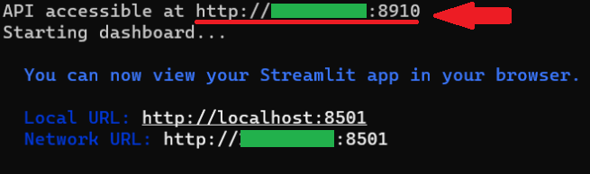

# Graphical_Optimizer

This project intends to create a hyperparameter graphical optimizer for python inspired by MATLAB's Experiment Manager.

The GraphicalOptimizer class creates the object that optimizes a given model using a set of hyperparameters.
The hyperparameters along with the resulting model performance metrics are displayed
using ``pandastable`` (a python GUI used for pandas data frame visualization).

The ``fit`` method can be used to begin the optimization.

## Parameters

- ``model_function``: Model training function.
  
The function that implements the model that takes different hyperparameters for experimenting.
This function is assumed to return the model so it can be used for making predictions and measuring
its performance. Optionally, a second output for displaying mid-training performance can be included
when returning the function. This second output must be a dictionary and must be able to be JSON
serializable.

- ``prediction_function``: Prediction function.

The function takes the model function and input data to make a prediction.
This function is assumed to return the prediction so it can be used for calculating the prediction
performance.

- ``performance_function``: Performance calculation function.

The function that takes a prediction by the model to compare its performance with labeled data.
This function is assumed to return the scores in the type dictionary.
hyperparameters.

- ``hyperparameters``: All possible parameters.

A dictionary where the keys are defining the parameter name. The value for this key will define value
boundaries. Must take different forms when using bayesian search as opposed to using grid or random
search.

- ``performance_parameter``: Main model's performance indicator.

A string that corresponds to which key of the ``performance_function``'s output to use as the model's
score. This setting is important when performing Bayesian optimization as it determines which metric
will be MAXIMIZED.

- ``optimizer``: The optimizer search method to be used.

A string that defines which search algorithm to use. ``bayesian`` will use bayesian search. ``grid``
will iterate through all possible hyperparameter combinations. ``random`` will choose a random
selection of possible combinations up to the maximum number of combinations.

- ``max_num_combinatios``: Maximum number of combinations.

An integer that determines how many hyperparameter combinations to search for. This argument only
affects random and bayesian search. Grid search will always try all hyperparameter combinations. The
total number of experiments that the optimizer will run is ``max_num_combinatios * cross_validation``.

- ``cross_validation``: Number of cross-validation folds.

An integer that determines how many times the dataset will be split for performing cross-validation on
each hyperparameter combination.

- ``max_num_of_parallel_processes``: Number of experiments to run in parallel.

This integer determines how many parallel processes will be created for training multiple experiments at the same time. -1 will create the maximum possible number of parallel processes.

- ``parallel_combinations``: Number of simultaneous combinations to be tested.

This setting only affects bayesian search. This integer determines how many parallel combinations can be tested in bayesian search. If many combinations are tested simultaneously, the bayesian algorithm may perform worse than if it tested sequentially each combination.

- ``seed``: Seed for cross-validation.

An integer for determining the cross-validation random state.

- ``create_GUI``: Determines whether GUI should be created or not.

A boolean for allowing the App object to be created. If True, the optimizer window will be created. If
False, the GUI will not be instantiated. The optimizer will function the same way in the background
regardless of the presence of the GUI.

- ``concurrent_function``: A function that runs simultaneously to the optimization process.

A function that will be called on the same thread as the GUI whenever an experiment completes. 

- ``completion_function``: A function that runs after the hyperparameter search is over.

A function that will be called as soon as all experiments are completed. This can be used for code to run
parallel to the GUI when the hyperparameter search completes.

- ``verbose``: Optimizer verbosity.

An integer that controls how verbose the optimizer will be when queuing new experiments.
verbose=0 will display no messages. verbose=1 will display messages about the queued experiments.

## Examples

There are some example files provided that showcase how to create different optimization strategies. [This example](example_all_settings.py) shows how all settings can be used when creating the optimizer.

If you want to integrate Weights and Biases (wandb), look at [this example](example_wandb.py) which shows how this is possible.

## Dashboard integration

To start hosting the dashboard, use the following command:
```bash
python front_end/flask_app.py
```
This will host the GUI for plotting and uploading experiment results.

The API endpoint provided will allow you to send experiments from the optimizer as soon as they are completed.



This url can be passed into the ``dashboard_url`` parameter in the ``GraphicalOptimizer`` object.